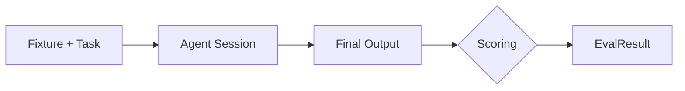
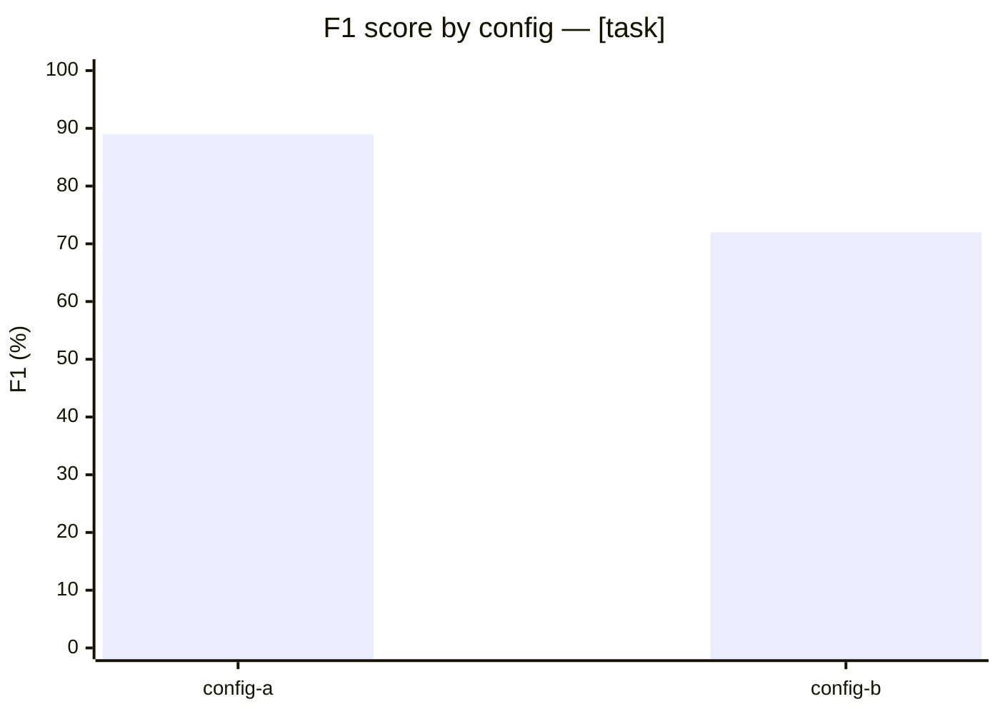
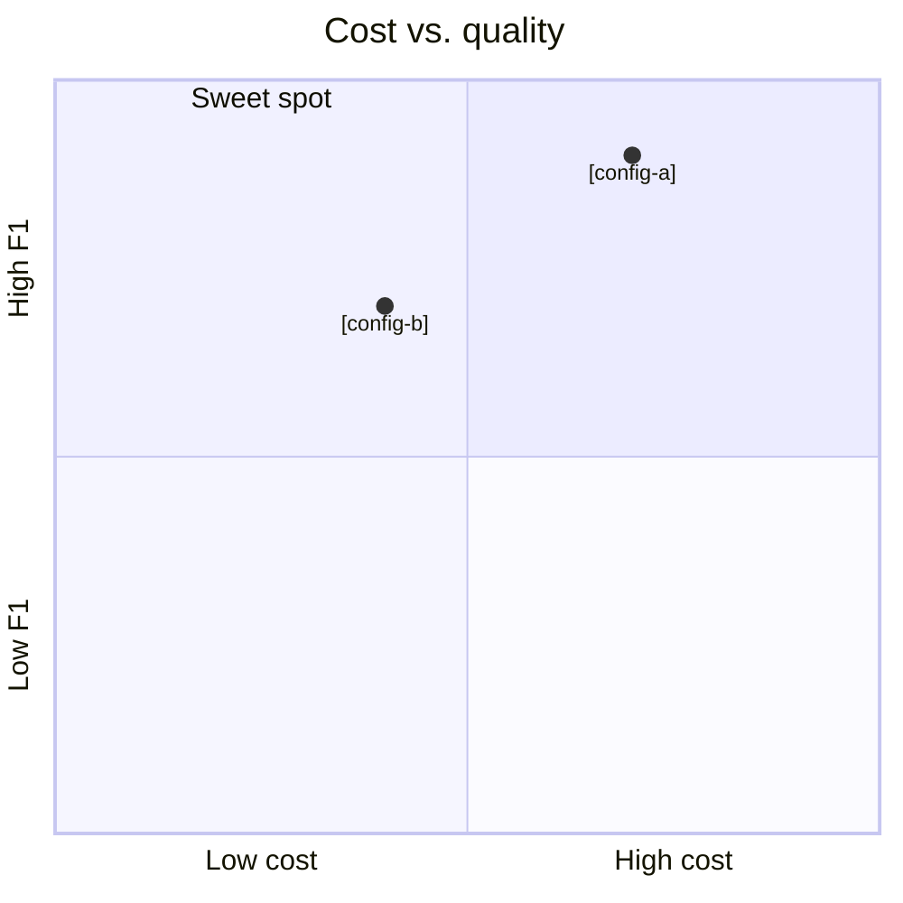

# [Report Title — specific, one line]

**[Optional subtitle with headline claim]**

*[YYYY-MM-DD] | [Author(s)]*

## Summary

<!-- 80–150 words. 3–5 bullets or one short paragraph. State what was benchmarked, against what, and the headline findings. No methodology detail, no charts. -->

- [Headline finding 1 with numbers]
- [Headline finding 2 with numbers]
- [Headline finding 3 — a nuance or tradeoff]

## Introduction

<!-- 150–300 words. Establish the gap this benchmark fills, state the core question in plain English, close with a one-sentence preview. -->

[Why does this benchmark matter? What existing benchmarks don't cover the question being asked?]

[State the core question concretely.]

[Close with a preview sentence pointing to the Results section.]

## Benchmark Design

<!-- 300–600 words total, plus diagrams. Subsections below. -->

### What we measure

[Concrete description of the metrics — score type, cost metrics, any qualitative observations tracked. Include a one-line example of what "a good score" looks like.]

### Tasks and fixtures

[Concrete description of each fixture — language, size, number of planted issues, what kinds of issues. Abstract descriptions like "a set of vulnerable code samples" don't earn reader trust.]

### Scoring methodology

[Explain the scoring function. If it's nontrivial, walk through one worked example end-to-end.]

### Models and configurations

[Table of the configurations evaluated, with what each varies.]

| Config | Model | Tools / MCP | Notes |
|---|---|---|---|
| [id] | [model] | [tools] | [notes] |

### Pipeline

<!-- Lift the pipeline diagram from the benchmark guide if one exists. Simplify if the original is more detailed than the report needs. -->



## Results

<!-- 400–600 words, chart-heavy. Lead with the leaderboard, follow with 1–3 charts, keep prose between charts to one paragraph per chart. -->

### Overall leaderboard

| Task | Config | Score | Tokens | Time |
|---|---|---|---|---|
| [task] | [config] | [x%] | [n] | [n]s |

[One paragraph calling out the pattern the reader should notice — not a restatement of the table.]

### Per-task breakdown



[One paragraph describing the chart's takeaway.]

### Cost vs. quality

<!-- Include only if token spend was measured. -->



[One paragraph describing the tradeoff pattern.]

## Qualitative Analysis

<!-- 600–1,500 words. 2–4 sub-sections. Each heading is a one-sentence thesis. Each sub-section: thesis → explanation → supporting number → implication. -->

### [Thesis statement 1 as the heading]

[Explanation. Include a specific number that supports the thesis.]

[What this means for a reader trying to choose between configs or interpret the score.]

### [Thesis statement 2 as the heading]

[Explanation with specific numbers.]

[Implication for readers.]

### [Thesis statement 3 as the heading — optional]

[Explanation with specific numbers.]

[Implication for readers.]

## Limitations

<!-- 150–300 words. Name every caveat specifically. Frame honestly. -->

[List each limitation as a numbered or bulleted item. Be specific — "single run per cell" is better than "limited sample size".]

1. **[Limitation 1 as a bold phrase].** [One-to-two-sentence explanation.]
2. **[Limitation 2].** [Explanation.]
3. **[Limitation 3].** [Explanation.]

## Future Work

<!-- 100–200 words. 3–5 specific next steps. Each should be concrete enough that you could imagine the resulting report. -->

- [Specific next step 1]
- [Specific next step 2]
- [Specific next step 3]

## Appendix

### Full results

<!-- Full per-run table if the body showed aggregates. -->

| Task | Config | Score | In tokens | Out tokens | Cache read | Cache write | Turns | Time |
|---|---|---|---|---|---|---|---|---|
| [...] | [...] | [...] | [...] | [...] | [...] | [...] | [...] | [...] |

### Reproducing the benchmark

```bash
# [commands to re-run]
```

[Where the fixtures live, how results are structured, how to compare across runs.]

### Acknowledgements

<!-- Optional — partners, early reviewers, prior work this builds on. -->
