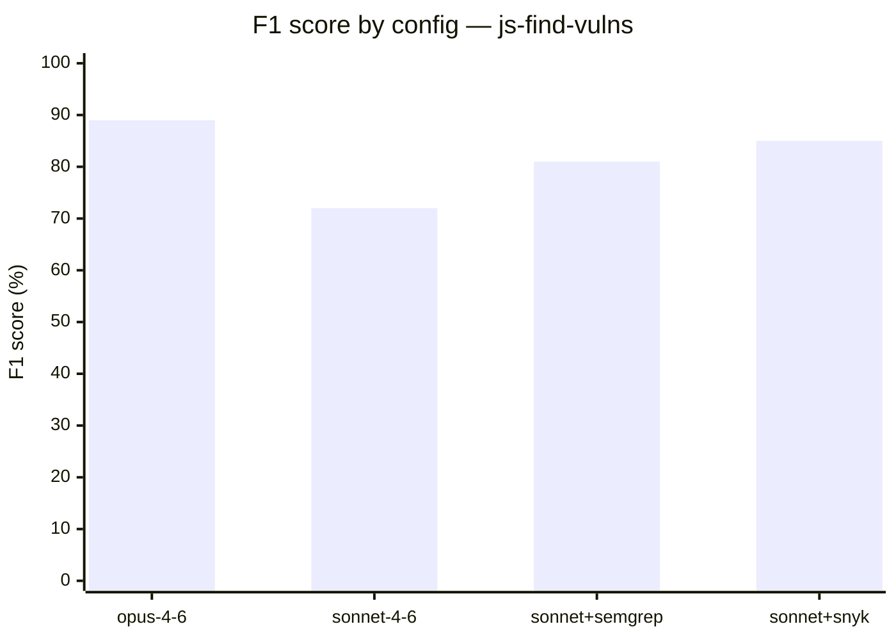
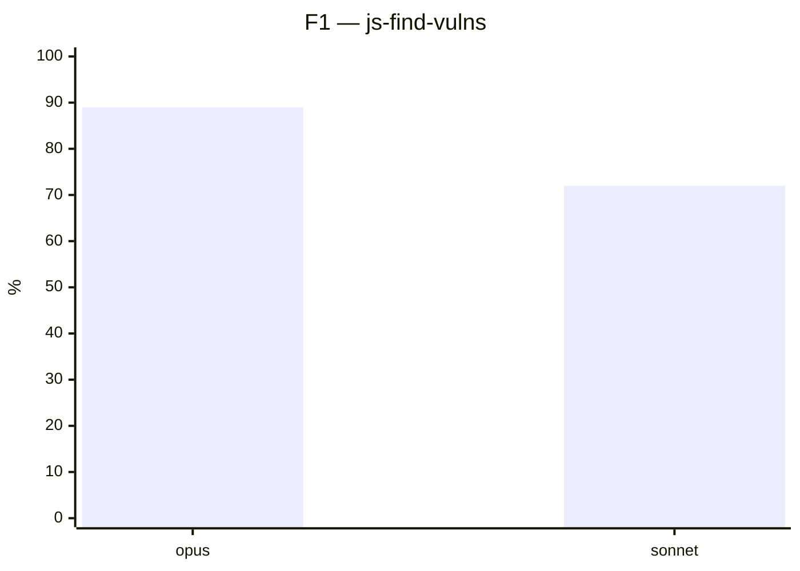
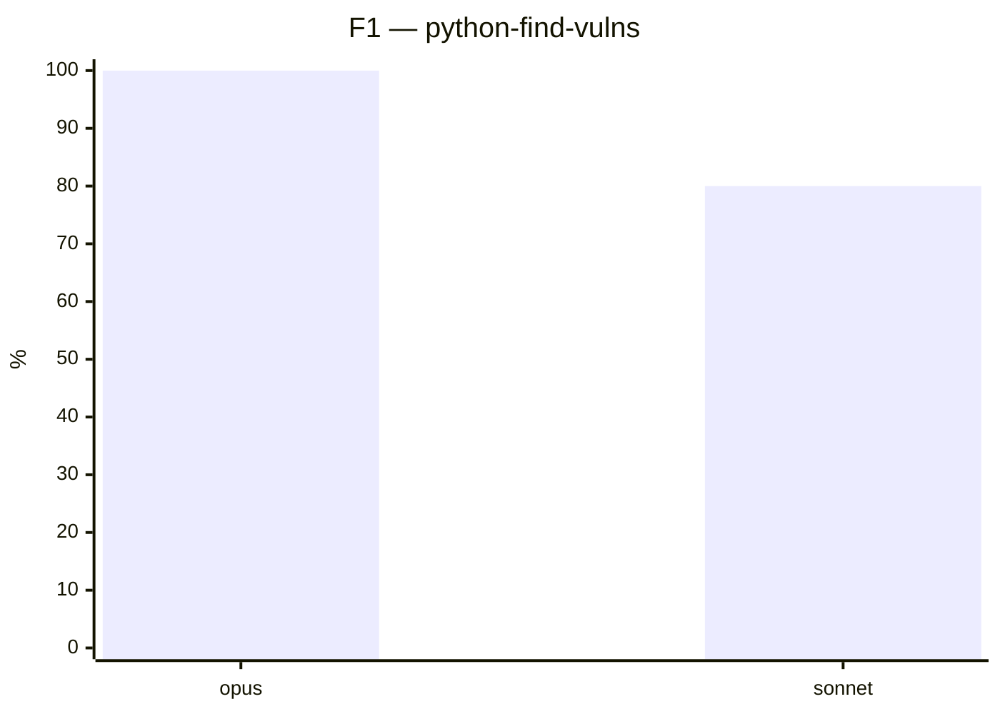
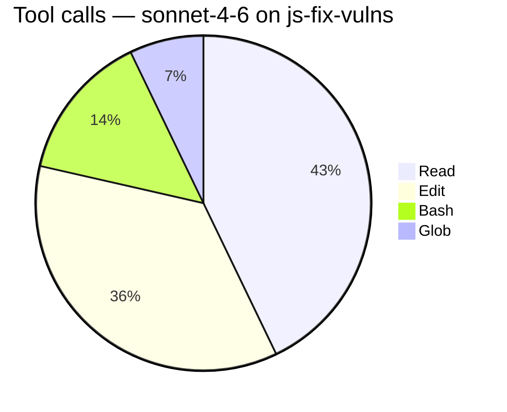
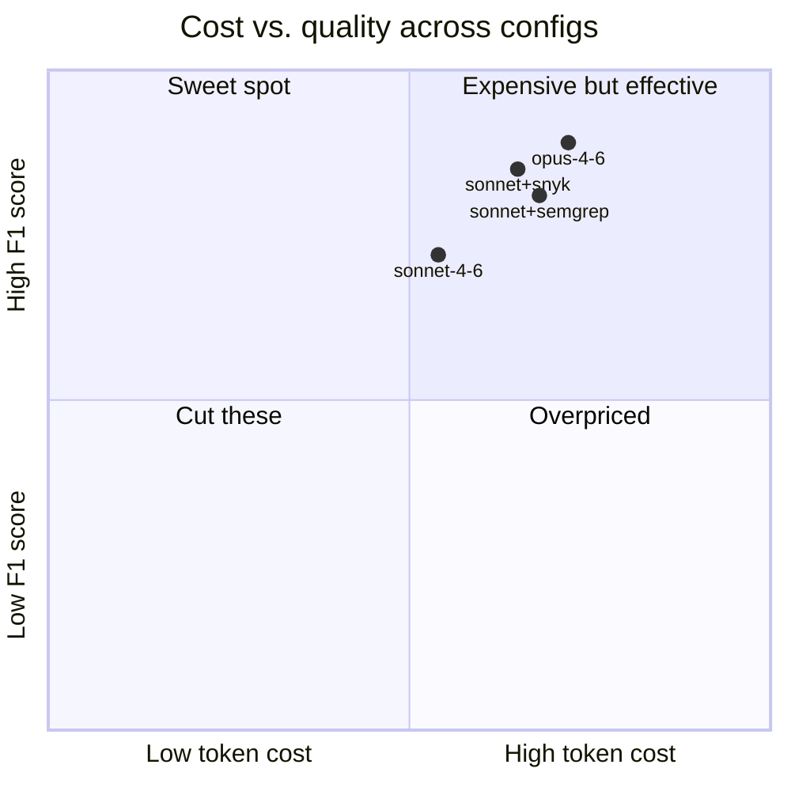
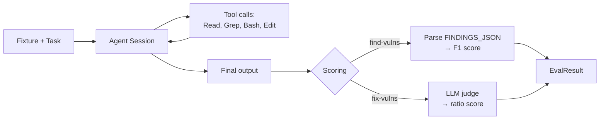
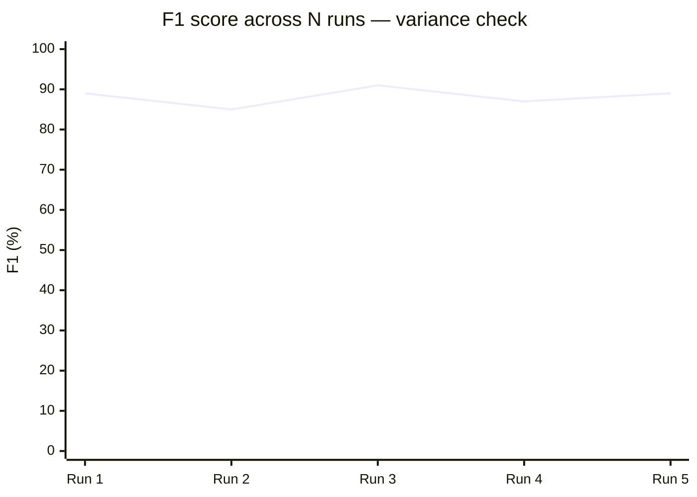

# Visualizations

Every chart must earn its place. A chart that restates the leaderboard table is noise; a chart that reveals a pattern the table hides is signal.

This reference pairs common benchmark questions with the chart type that answers them, and gives a mermaid snippet for each so you can drop it straight into the report.

## Decision table: which chart for which question

| Question the reader has | Chart type | Mermaid support |
|---|---|---|
| "Which config scored highest on each task?" | Grouped bar chart | Yes (`xychart-beta`) |
| "What's the quality/cost tradeoff?" | Scatter plot (score vs. tokens) | Partial — use quadrantChart or a table |
| "How did each config spend its tool-use time?" | Stacked bar or pie | Pie yes; stacked bar via `xychart-beta` with multiple bar series |
| "How did scores vary across N runs of the same config?" | Dot/strip plot with error bars | No — use a table or external image |
| "What's the overall leaderboard?" | Markdown table | N/A (not a chart) |
| "What does the eval pipeline look like?" | Flowchart | Yes (`flowchart`) |
| "How do configs cluster on two dimensions?" | Quadrant chart | Yes (`quadrantChart`) |
| "What's the distribution of task difficulty?" | Histogram | No — use a table or external image |

When mermaid doesn't support what you need, use a markdown table as the fallback and add an HTML comment noting that the table could be replaced with a rendered chart: `<!-- TODO: render as matplotlib scatter before publishing -->`.

## Leaderboard table (always include one)

The leaderboard is the heart of the Results section. Use a markdown table, one row per (task × config) cell or per config with task columns, depending on dimensionality.

Per-cell format — works well when task × config is small:

```markdown
| Task | Config | Score | Tokens | Time |
|---|---|---|---|---|
| js-find-vulns | opus-4-6 | 89% | 18,432 | 24.8s |
| js-find-vulns | sonnet-4-6 | 72% | 14,210 | 19.3s |
| js-fix-vulns | sonnet-4-6 | 80% | 42,100 | 48.2s |
```

Per-config format — better when there are many tasks and few configs:

```markdown
| Config | js-find | js-fix | python-find | Avg |
|---|---|---|---|---|
| opus-4-6 | 89% | — | 100% | 94% |
| sonnet-4-6 | 72% | 80% | 80% | 77% |
```

Round percentages to the nearest whole number in leaderboards — precision beyond that is usually noise.

## Bar chart: score comparison

Use when comparing 2–6 configs on one metric, for one task or averaged.



Keep y-axis bounded to `0 --> 100` for percentage scores — truncated axes mislead.

## Grouped bar chart: score across tasks

When comparing configs across multiple tasks, render each task as its own bar chart block. Mermaid's `xychart-beta` does not cleanly support grouped bars, so the cleanest option is either:

- Multiple single-config bar charts side by side (one per task), or
- One chart per task, each comparing all configs.

Example — one per task:





For 3+ tasks, consider a table instead — three separate charts is usually worse than one clear table.

## Pie chart: tool-use distribution

Use when explaining how a specific config spent its tool budget. Works best for a single config — a comparison of tool-use across configs is better as a table.



## Quadrant chart: cost vs. quality

Use when you want to show a Pareto frontier — configs in the top-right are "expensive and good", bottom-right are "cheap and good" (the winner region), top-left are "expensive and bad" (clear losers).



Values are normalized to 0–1 for both axes. Compute them as `value / max(values)` in your scratchpad.

## Flowchart: benchmark pipeline

Lift this from the benchmark guide verbatim if one exists — don't redraw what's already clear. A typical pipeline:



Keep it one-screen. If the guide's diagram is larger, simplify for the report and link to the full one in the Appendix.

## Line chart: score over iterations (for agents with self-correction)



Only include if you actually have multi-run data. Inventing variance from a single run to make a chart is a fireable offense.

## When to fall back to an external image

Mermaid renders well in GitHub, most static-site generators, and many blog platforms, but:
- Distribution plots, histograms, and scatter plots with 20+ points are painful in mermaid.
- Multi-series charts with a legend (stacked bars, grouped bars with 4+ groups) look crude.
- Publication-quality marketing-style charts may need matplotlib/vega output.

When falling back:
1. Produce a markdown table with the data.
2. Add an HTML comment with the chart intent: `<!-- TODO: render as matplotlib scatter, x=tokens y=F1, color by config -->`.
3. Tell the user in the delivery summary which charts need external rendering.

If the user asks for the images to be generated, write a small Python script to `scripts/` in the project and run it to produce SVGs alongside the report.

## Chart labeling rules

- Title every chart. A chart without a title forces the reader to re-derive what it shows from context.
- Label both axes, with units where relevant ("F1 (%)", "Tokens", "Seconds").
- Pin percentage axes at `0 --> 100` to avoid misleading truncation.
- If a chart's story is "these two are close", don't use a chart — use prose. Charts amplify differences, which can mislead when the takeaway is "they're similar".

## Data sanity checks before publishing a chart

Before finalizing any chart:
- Do the values in the chart match the scratchpad from Step 2?
- Are the labels correctly matched to the values? (off-by-one in the label array is a classic bug)
- Is the axis range reasonable? (no `-5 --> 105` for percentages)
- Does the chart title match the text paragraph describing it?

A wrong chart is worse than no chart — readers spend seconds on a chart and internalize what it shows, even if the prose contradicts it.
