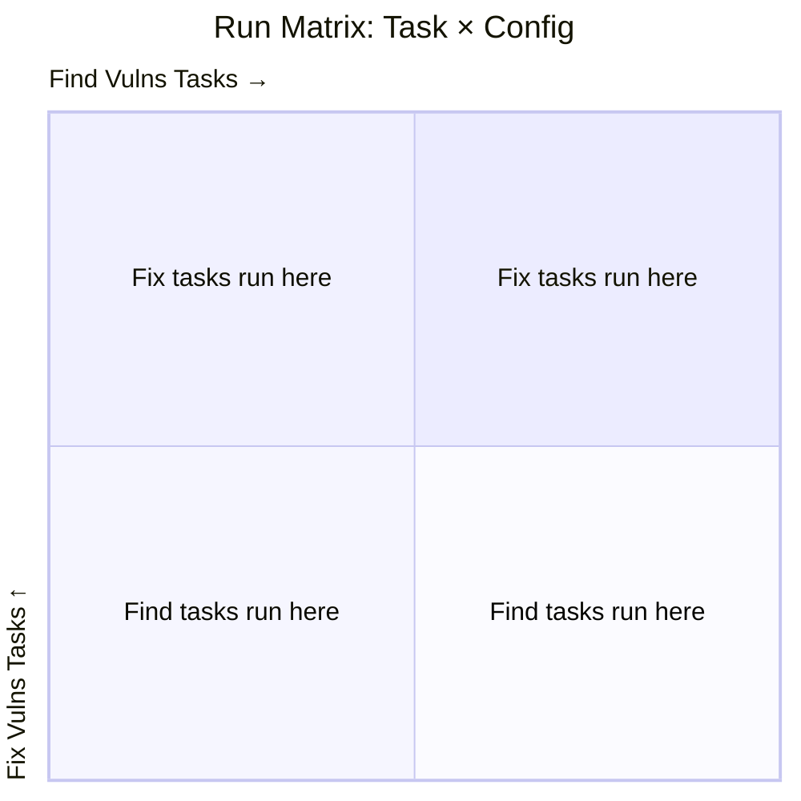
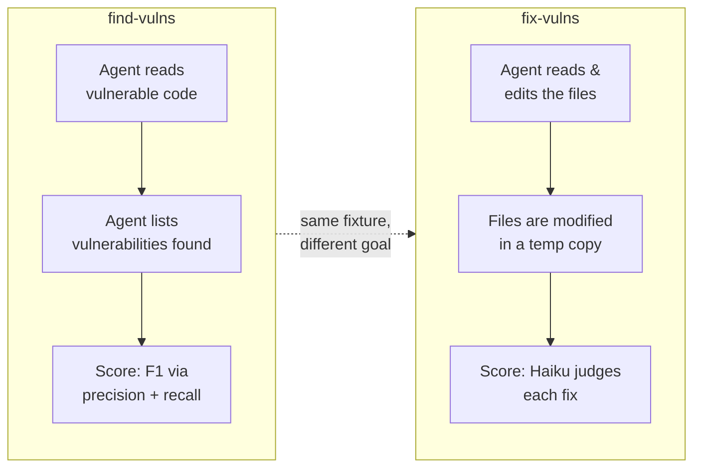
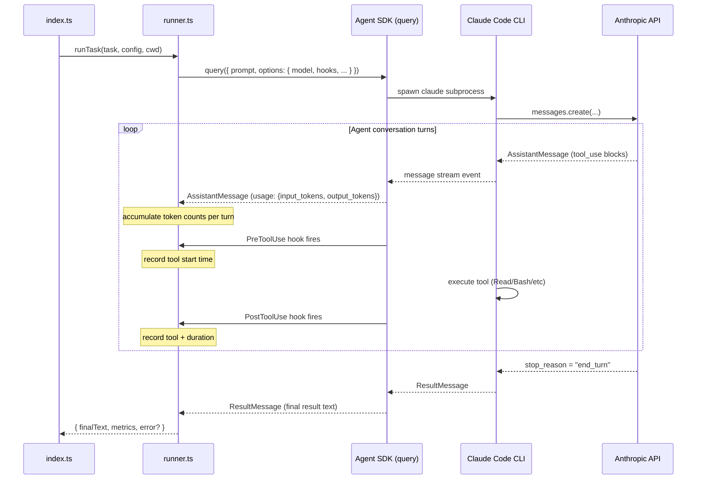
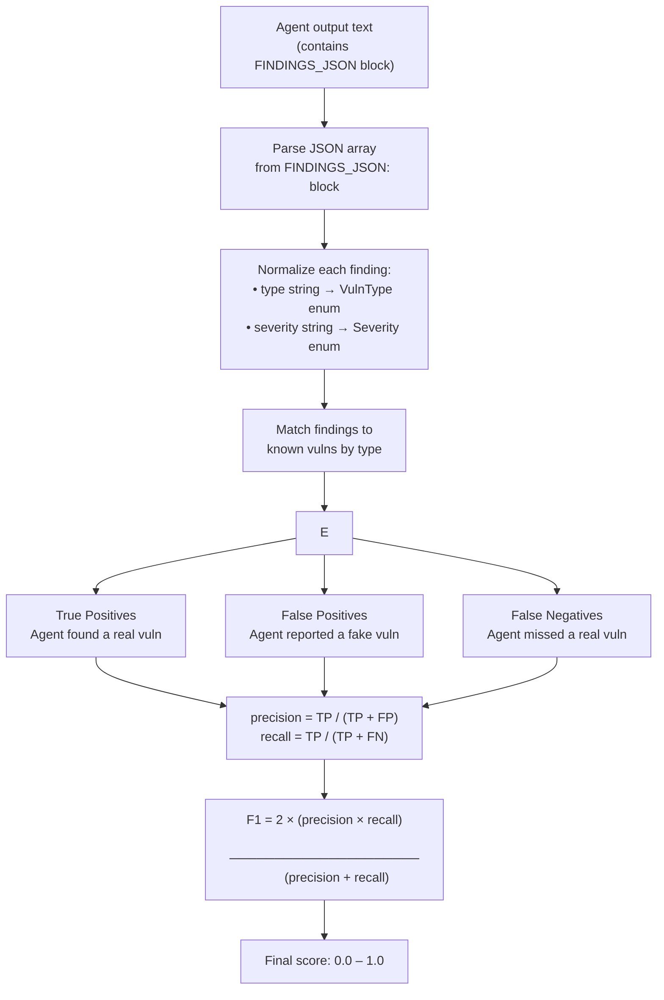
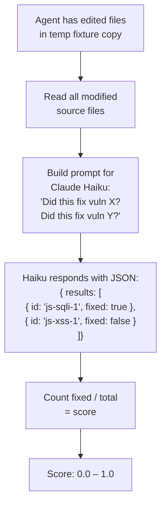

# Benchmark System — How It Works

## Table of Contents

1. [The Core Idea in One Sentence](#the-core-idea-in-one-sentence)
2. [High-Level Overview](#high-level-overview)
   - [The Three Questions This Benchmark Answers](#the-three-questions-this-benchmark-answers)
   - [The Full Pipeline — Flowchart](#the-full-pipeline--flowchart)
   - [How Tasks and Configs Combine](#how-tasks-and-configs-combine)
   - [The Two Eval Categories](#the-two-eval-categories)
3. [Detailed Component Reference](#detailed-component-reference)
   - [Fixtures — The Test Cases](#fixtures--the-test-cases)
   - [EvalTask — What to Do](#evaltask--what-to-do)
   - [RunConfig — Who Does It](#runconfig--who-does-it)
   - [Runner — The Agent Session](#runner--the-agent-session)
   - [Metrics — What Was Measured](#metrics--what-was-measured)
   - [Scorer — How Good Was It](#scorer--how-good-was-it)
   - [Reporter — Presenting Results](#reporter--presenting-results)
   - [EvalResult — The Final Record](#evalresult--the-final-record)
4. [Worked Example: A Single Run](#worked-example-a-single-run)
5. [Scoring Deep-Dive](#scoring-deep-dive)
6. [Adding Your Own Tasks and Configs](#adding-your-own-tasks-and-configs)

---

## The Core Idea in One Sentence

We give an AI coding agent a piece of vulnerable code, ask it to find or fix the vulnerabilities, and then measure both **how well it did** (score) and **how expensive it was** (tokens, time, tool calls).

---

## High-Level Overview

### The Three Questions This Benchmark Answers

| Question | Metric |
|---|---|
| **Quality**: Did the agent find/fix the right vulnerabilities? | Score (0–100%) |
| **Cost**: How many tokens did it spend? | Input + output tokens |
| **Efficiency**: How did it spend its time? | Wall time, tool call breakdown |

By running the same tasks against different model configurations, you can compare them across all three dimensions at once.

---

### The Full Pipeline — Flowchart

This is the end-to-end flow for a single run. A "run" is one combination of one task and one configuration.

```mermaid
flowchart TD
    A(["`**START**
    pnpm run benchmark`"]) --> B

    subgraph SETUP["① Setup"]
        B[Parse CLI args\n--category, --task, --config] --> C
        C[Select matching\nEvalTasks] --> D
        D[Select matching\nRunConfigs]
    end

    D --> E

    subgraph LOOP["② For each Task × Config pair..."]
        E[/"For every combination\nof task + config"/] --> F
        F{task.type?}
        F -->|fix-vulns| G["Copy fixture to\ntemp directory\n(protect original)"]
        F -->|find-vulns| H["Use fixture\ndirectory directly\n(read-only)"]
        G --> I
        H --> I
    end

    subgraph AGENT["③ Run Agent Session"]
        I["runTask(task, config, cwd)"] --> J
        J["Launch Claude Code via\nAgent SDK query()"] --> K

        subgraph HOOKS["Hooks fire on every tool call"]
            K --> L["PreToolUse hook\nrecord start time"]
            L --> M["Agent uses tools:\nRead, Grep, Glob,\nBash, Write, Edit"]
            M --> N["PostToolUse hook\nrecord duration"]
            N --> O{More tools\nneeded?}
            O -->|yes| L
            O -->|no| P
        end

        P["ResultMessage received\n(agent finished)"] --> Q
        Q["Collect from stream:\n• per-turn token usage\n• tool call records\n• final text output"]
    end

    subgraph SCORE["④ Score the Output"]
        Q --> R{task.type?}
        R -->|find-vulns| S["Parse FINDINGS_JSON\nfrom agent output"]
        S --> T["Compare found vulns\nagainst vulns.json\nground truth"]
        T --> U["Calculate\nprecision + recall\n→ F1 score"]
        R -->|fix-vulns| V["Read modified\nfiles from temp dir"]
        V --> W["Ask Claude Haiku\nto judge each fix"]
        W --> X["Count fixed/total\n→ ratio score"]
    end

    subgraph RECORD["⑤ Record & Report"]
        U --> Y["Build EvalResult\n(score + metrics + details)"]
        X --> Y
        Y --> Z["Print to console\n(table with score,\ntokens, tool stats)"]
        Z --> AA["Append to JSONL file\nin results/"]
    end

    AA --> AB{More runs?}
    AB -->|yes| E
    AB -->|no| AC["Print summary table\nfor all runs"]
    AC --> AD([END])

    style SETUP fill:#e8f4f8,stroke:#2980b9
    style LOOP fill:#fef9e7,stroke:#f39c12
    style AGENT fill:#e8f8e8,stroke:#27ae60
    style SCORE fill:#fce4ec,stroke:#c0392b
    style RECORD fill:#f3e5f5,stroke:#8e44ad
    style HOOKS fill:#e0f7e0,stroke:#27ae60,stroke-dasharray: 5 5
```



---

### How Tasks and Configs Combine

The benchmark runs every task against every config. This is the **matrix of runs**:



More concretely, with the default setup:

```
                    ┌─────────────────────────────────────────────────────────┐
                    │                    RUN CONFIGS                           │
                    │   opus-4-6               │   sonnet-4-6                 │
  ┌─────────────────┼──────────────────────────┼──────────────────────────────┤
  │  js-find-vulns  │  Run 1: Opus finds JS     │  Run 2: Sonnet finds JS      │
E │                 │  vulns in Express app     │  vulns in Express app        │
V ├─────────────────┼──────────────────────────┼──────────────────────────────┤
A │  js-fix-vulns   │  Run 3: Opus fixes JS     │  Run 4: Sonnet fixes JS      │
L │                 │  vulns in Express app     │  vulns in Express app        │
  ├─────────────────┼──────────────────────────┼──────────────────────────────┤
T │ python-find-    │  Run 5: Opus finds Python │  Run 6: Sonnet finds Python  │
A │ vulns           │  vulns in Flask app       │  vulns in Flask app          │
S └─────────────────┴──────────────────────────┴──────────────────────────────┘
K
S       3 tasks   ×   2 configs   =   6 total runs
```

Each cell in this matrix is one independent `EvalResult`. After all runs complete, you can compare rows (same task, different configs) to understand which model/config performs better.

---

### The Two Eval Categories (and How They Relate to Eval Tasks)

An **Eval Category** (`EvalCategory`) is a first-class data structure that determines the agent's goal and the scoring strategy. Each **Eval Task** carries a `category` field pointing to one of the entries in the `EVAL_CATEGORIES` registry — so the category both groups tasks and carries its own metadata.

```
EVAL_CATEGORIES.FIND_VULNS        EVAL_CATEGORIES.FIX_VULNS
  { id: "find-vulns", name: ... }   { id: "fix-vulns", name: ... }
         │                                    │
         ├── EvalTask: js-find-vulns           └── EvalTask: js-fix-vulns
         └── EvalTask: python-find-vulns
```

The `--category` CLI flag filters the task list by category id (e.g. `--category find-vulns` runs only the first group above). Adding a new category means adding one entry to `EVAL_CATEGORIES` in `src/types.ts` — `EvalCategoryId` expands automatically.

The type also governs two other things beyond grouping:



**find-vulns** is like an exam where you're asked to *identify* problems. The agent reads the code and reports what it finds.

**fix-vulns** is like an exam where you're asked to *solve* problems. The agent not only identifies but also edits the source files. We work on a copy of the fixture so the originals are never changed.

---

## Detailed Component Reference

### Fixtures — The Test Cases

**Location:** `fixtures/`

A fixture is a self-contained directory containing vulnerable source code. It is the "exam question" — the thing we're testing the agent against.

```
fixtures/
  js-vulns/
    app.js        ← The vulnerable code (intentionally bad)
    vulns.json    ← Ground truth: exactly which vulns exist and where
  python-vulns/
    app.py
    vulns.json
```

The `vulns.json` file is the **answer key**. It describes every vulnerability that exists in the fixture, along with metadata used for scoring:

```json
{
  "vulnerabilities": [
    {
      "id": "js-sqli-1",          // unique ID used in scoring comparisons
      "type": "sql-injection",    // vulnerability category
      "severity": "critical",     // how dangerous it is
      "file": "app.js",           // which file it's in
      "line": 28,                 // which line
      "description": "User input directly concatenated into SQL query"
    }
  ]
}
```

The `id` field is critical — the scorer uses these IDs to track which vulnerabilities were found vs. missed, and which were fixed vs. still present.

**Why fixtures matter:** Without a fixed, known-good ground truth, you cannot objectively score the agent. The fixture + vulns.json pair is the thing that makes this a rigorous benchmark rather than a vibe check.

---

### EvalTask — What to Do

**Location:** `evals/tasks/*.json` — one JSON file per task, loaded at startup by `src/evals/loader.ts`

An `EvalTask` is a complete description of one assignment to give an agent. Think of it as a single exam question.

```typescript
interface EvalTask {
  id: string;            // unique identifier, used in CLI filtering
  name: string;          // human-readable name for output
  category: EvalCategory; // points to EVAL_CATEGORIES.FIND_VULNS or .FIX_VULNS
  fixture: string;       // path to the fixture directory
  systemPrompt?: string; // instructions injected before the task starts
  prompt: string;        // the main instruction sent to the agent
  knownVulns: Vulnerability[]; // loaded automatically from the fixture's vulns.json
  maxTurns?: number;     // max agent conversation turns (prevents runaway)
}
```

Key design decisions baked into the task definition:

- **`systemPrompt`** tells the agent *how* to work. For find-vulns, it instructs the agent to output a structured `FINDINGS_JSON` block at the end — without this, we couldn't reliably parse the agent's findings.
- **`knownVulns`** is loaded automatically from the fixture's `vulns.json` by the loader — you never need to duplicate this data.
- **`maxTurns`** is a safety valve. An unconstrained agent could loop forever; this caps it.

---

### RunConfig — Who Does It

**Location:** `evals/run-configs.json` — a JSON array loaded at startup by `src/evals/loader.ts`

A `RunConfig` describes *which agent* should run the task — the model identity and any additional tools it has access to.

```typescript
interface RunConfig {
  id: string;                              // unique identifier
  name: string;                            // human-readable label
  model: string;                           // e.g. "claude-opus-4-6"
  mcpServers?: Record<string, MCPServer>;  // optional: tool servers
  maxTurns?: number;                       // fallback turn limit
}
```

The separation of `EvalTask` and `RunConfig` is the key architectural decision that makes this a *benchmark* rather than a one-off script. It lets you answer the question: **"Does this task get a better score with a different model or tool setup?"**

Example comparison enabled by this design:

| RunConfig | What it isolates |
|---|---|
| `opus-4-6` vs `sonnet-4-6` | Raw model quality difference |
| `sonnet-4-6` vs `sonnet-4-6-with-semgrep-mcp` | Value of adding a security analysis tool |
| `sonnet-4-6` vs `sonnet-4-6-with-snyk-mcp` | Snyk vs semgrep for the same model |

To add a config with an MCP server:
```typescript
{
  id: "sonnet-with-semgrep",
  name: "Claude Sonnet 4.6 + semgrep MCP",
  model: "claude-sonnet-4-6",
  mcpServers: {
    semgrep: { command: "npx", args: ["@semgrep/mcp"] }
  }
}
```

---

### Runner — The Agent Session

**Location:** `src/runner.ts`

The runner is the bridge between your benchmark harness and the actual Claude Code agent. It calls `query()` from `@anthropic-ai/claude-agent-sdk` and instruments it to collect metrics.



**What makes this work:**

The Agent SDK fires two hook events around every tool call:

```typescript
hooks: {
  PreToolUse:  [{ matcher: ".*", hooks: [preHook]  }],  // fires BEFORE tool runs
  PostToolUse: [{ matcher: ".*", hooks: [postHook] }],  // fires AFTER tool runs
}
```

We use a `Map<tool_use_id, startTime>` to pair up the pre and post events, giving us the duration of each individual tool call. This is more reliable than trying to parse timing from the message stream.

**Token counting:**

The Agent SDK's message stream includes a `usage` field on every `AssistantMessage`. Each field represents the token count for that one turn. We accumulate them all to get session totals:

```
Turn 1: { input: 1200, output: 300 }
Turn 2: { input: 3400, output: 800 }   ← context grows each turn
Turn 3: { input: 4100, output: 200 }
                               ───────
Total input:  8700   (each turn re-sends the full context)
Total output: 1300   (just the new tokens Claude generated)
```

Note: input tokens grow each turn because the API is stateless — the full conversation history is re-sent every turn. This means a long agent session can be significantly more expensive than its output token count suggests.

**`bypassPermissions` mode:**

The runner uses `permissionMode: "bypassPermissions"` so that file reads and writes in the fixture directory don't pause waiting for user approval. This is essential for automated benchmarking. The `allowDangerouslySkipPermissions: true` flag explicitly acknowledges the risk.

---

### Metrics — What Was Measured

**Location:** `src/types.ts` → `BenchmarkMetrics`

After a run completes, the runner returns a `BenchmarkMetrics` object:

```typescript
interface BenchmarkMetrics {
  sessionDurationMs: number;   // wall clock time from first message to ResultMessage
  totalInputTokens: number;    // sum of input tokens across all turns
  totalOutputTokens: number;   // sum of output tokens across all turns
  totalTurns: number;          // how many back-and-forth turns occurred
  toolCalls: ToolCallRecord[]; // one entry per individual tool execution
  toolStats: {                 // aggregated per tool name
    [toolName: string]: {
      count: number;           // how many times this tool was called
      totalDurationMs: number; // total time spent in this tool
    }
  };
}
```

**Why `toolStats` matters:**

Different models use tools differently. A model that calls `Bash` 20 times and `Read` 5 times has a very different behavior profile than one that calls `Read` 40 times and `Bash` 0 times. `toolStats` lets you see this. For security tasks especially, you might care whether the model:

- Used `Bash` to run static analysis tools (expensive, potentially powerful)
- Used only `Read` + `Grep` (cheaper, simpler)
- Called `Write`/`Edit` (only relevant for fix-vulns)

---

### Scorer — How Good Was It

**Location:** `src/scorer.ts`

The scorer translates the agent's raw output into a number between 0 and 1. The logic is different for each eval category.

#### find-vulns Scoring



**Precision vs Recall:**

- **Precision** answers: "Of all the things the agent reported, what fraction were real vulnerabilities?" A low precision means lots of false alarms.
- **Recall** answers: "Of all the real vulnerabilities, what fraction did the agent find?" A low recall means important vulns were missed.
- **F1** is the harmonic mean — it's 1.0 only when both precision and recall are 1.0. It penalizes both missing vulns and crying wolf.

**Why structured output (`FINDINGS_JSON`)?**

The system prompt asks the agent to output its findings in a specific JSON format at the end:

```
FINDINGS_JSON:
```json
[{ "type": "sql-injection", "file": "app.js", "line": 28, ... }]
```
```

Without this, parsing free-text like "I found a SQL injection vulnerability on line 28 of app.js" is fragile and unreliable. The structured format makes scoring deterministic.

#### fix-vulns Scoring



For fix-vulns, we can't use the same parse-and-compare approach because the agent's output is the modified source files, not text. Instead, we use **Claude Haiku as a judge**: we show it the modified code and ask it to assess each known vulnerability.

We use Haiku (not Opus/Sonnet) for the judge because:
- It's much cheaper — scoring many runs would be costly with a more expensive model
- This is a straightforward yes/no judgment task that doesn't require deep reasoning
- Speed matters less here (scoring happens after the run, not inline)

**Why a temp copy for fix-vulns?**

When the agent fixes vulnerabilities, it actually edits the source files. If it edited the original fixtures, the next run against that fixture would start from already-fixed code, producing misleading results. By copying the fixture to a temp directory first (`index.ts` does this before calling `runTask`), each run always starts from the same baseline.

---

### Reporter — Presenting Results

**Location:** `src/reporter.ts`

The reporter handles output. It has three functions:

**`printResult(result)`** — prints a detailed block for one run immediately after it completes:
```
──────────────────────────────────────────────────────────────────────
Task:    JS App: Find Vulnerabilities
Config:  Claude Opus 4.6 (no MCP)
Score:   80%
Tokens:  24,300 (in: 21,000, out: 3,300)
Time:    18.4s  |  Turns: 7

Recall:    80%  (4/5 known vulns found)
Precision: 100% (0 false positives)
Missed:    js-cmd-injection-1

Top tools:
  Read: 8x, avg 120ms
  Grep: 4x, avg 95ms
  Glob: 2x, avg 88ms
```

**`printSummaryTable(results)`** — prints a compact comparison table after all runs finish:
```
══════════════════════════════════════════════════════════════════════
BENCHMARK SUMMARY
══════════════════════════════════════════════════════════════════════
Task                      Config              Score  Tokens   Time(s)
────────────────────────  ──────────────────  ─────  ───────  ───────
js-find-vulns             opus-4-6            80%    24300    18.4
js-find-vulns             sonnet-4-6          60%    18200    14.1
js-fix-vulns              opus-4-6            60%    41000    42.3
python-find-vulns         opus-4-6            100%   22100    16.8
```

**`saveResults(results, dir)`** — writes each result as a JSON line to `results/benchmark-<timestamp>.jsonl`. JSONL (JSON Lines) format means one complete JSON object per line, making it easy to:
- Load into analysis tools (Python pandas, etc.)
- Append new results without re-reading old ones
- Query with `jq` from the command line

---

### EvalResult — The Final Record

**Location:** `src/types.ts` → `EvalResult`

Every run produces exactly one `EvalResult`. It is the complete record of everything that happened:

```typescript
interface EvalResult {
  taskId: string;          // e.g. "js-find-vulns"
  taskName: string;        // e.g. "JS App: Find Vulnerabilities"
  runConfigId: string;     // e.g. "opus-4-6"
  runConfigName: string;   // e.g. "Claude Opus 4.6 (no MCP)"
  score: number;           // 0.0–1.0
  metrics: BenchmarkMetrics; // tokens, time, tool calls
  details: FindVulnsDetails | FixVulnsDetails; // what happened in scoring
  timestamp: string;       // ISO 8601 — when this run happened
  error?: string;          // set if the run crashed
}
```

`details` is a union type that holds scoring-specific data:

For **find-vulns**:
```typescript
{
  agentFindings: Vulnerability[];   // what the agent actually reported
  truePositives: string[];          // IDs of correctly identified vulns
  falsePositives: number;           // count of spurious reports
  falseNegatives: string[];         // IDs of missed vulns
  precision: number;                // 0–1
  recall: number;                   // 0–1
}
```

For **fix-vulns**:
```typescript
{
  vulnsAttempted: number;  // total known vulns in the fixture
  vulnsFixed: number;      // how many the judge confirmed as fixed
  judgeNotes: string;      // Haiku's explanation for each vuln
}
```

---

## Worked Example: A Single Run

Let's trace exactly what happens when you run:

```bash
pnpm run benchmark -- --task js-find-vulns --config opus-4-6
```

**Step 1 — Setup (`index.ts`)**
- Filters `EVAL_TASKS` to just `js-find-vulns`
- Filters `DEFAULT_RUN_CONFIGS` to just `opus-4-6`
- 1 task × 1 config = 1 run

**Step 2 — Prepare the working directory (`index.ts`)**
- `task.type === "find-vulns"` → no copy needed
- Sets `cwd = fixtures/js-vulns/` (the agent will start here)

**Step 3 — Run the agent (`runner.ts`)**
- Calls `query({ prompt: "Audit all files...", options: { cwd, model: "claude-opus-4-6", hooks: [...] } })`
- The Agent SDK spawns the Claude Code CLI as a subprocess
- The agent starts in `fixtures/js-vulns/` and begins reading `app.js`
- The `PreToolUse` hook fires before each tool call, recording its start time
- The `PostToolUse` hook fires after, recording tool name + duration
- Each `AssistantMessage` from the stream contributes its `usage.input_tokens` and `usage.output_tokens` to running totals
- When the agent finishes, we receive a `ResultMessage` with the final text

**Step 4 — The agent's output (example)**
```
I've analyzed app.js and found the following security vulnerabilities:

The application contains several critical security issues...
[analysis text]

FINDINGS_JSON:
```json
[
  { "type": "sql-injection", "file": "app.js", "line": 28, "severity": "critical", "description": "..." },
  { "type": "xss", "file": "app.js", "line": 42, "severity": "high", "description": "..." },
  { "type": "path-traversal", "file": "app.js", "line": 56, "severity": "high", "description": "..." },
  { "type": "hardcoded-credentials", "file": "app.js", "line": 8, "severity": "high", "description": "..." }
]
```
```

**Step 5 — Score (`scorer.ts`)**
- Parses the JSON block: 4 findings
- Known vulns: 5 (`js-sqli-1`, `js-xss-1`, `js-path-traversal-1`, `js-cmd-injection-1`, `js-hardcoded-creds-1`)
- Matching:
  - `sql-injection` → matches `js-sqli-1` ✓
  - `xss` → matches `js-xss-1` ✓
  - `path-traversal` → matches `js-path-traversal-1` ✓
  - `hardcoded-credentials` → matches `js-hardcoded-creds-1` ✓
  - `js-cmd-injection-1` → NOT found ✗
- TP=4, FP=0, FN=1
- Precision = 4/4 = 1.0, Recall = 4/5 = 0.8
- F1 = 2×(1.0×0.8)/(1.0+0.8) = **0.889**

**Step 6 — Report (`reporter.ts`)**
- `printResult()` writes the detailed block to console
- `saveResults()` appends the full `EvalResult` JSON to `results/benchmark-<timestamp>.jsonl`

---

## Scoring Deep-Dive

### Why F1 and Not Just Recall?

You might think "recall is what matters — finding all the vulns is the goal." That's partially true, but a system that reports *every possible string combination as a vulnerability* would have 100% recall and be useless. F1 penalizes that by also requiring precision.

```
Scenario A: Agent finds 5/5 known vulns but also reports 20 fake ones
  Precision = 5/25 = 0.20    Recall = 5/5 = 1.00    F1 = 0.33

Scenario B: Agent finds 4/5 known vulns with no false alarms
  Precision = 4/4 = 1.00    Recall = 4/5 = 0.80    F1 = 0.89

Scenario B is the better result — and F1 correctly ranks it higher.
```

### How Vuln Type Matching Works

The scorer matches agent findings to known vulnerabilities by their **type**, not by file and line. This is intentional:

- An agent might say "line 29" instead of "line 28" — exact line matching would unfairly penalize this
- An agent might phrase it as "SQL injection" or "SQLi" or "SQL Injection" — the scorer normalizes all of these to `"sql-injection"` before comparing
- Each known vuln can only be matched once (no double-counting)

If you add a fixture with two different SQL injections in the same file, give them different IDs (`sqli-1`, `sqli-2`) and the scorer will correctly track them separately.

---

## Adding Your Own Tasks and Configs

No source code changes required — the benchmark uses a directory-scanning loader. See [`docs/benchmark-management.md`](./benchmark-management.md) for the full guide, including field references, worked examples, and troubleshooting.

**Quick summary:**

- **New fixture:** create `fixtures/<name>/` with your vulnerable code and a `vulns.json` answer key
- **New eval task:** drop a JSON file in `evals/tasks/<id>.json` with `id`, `name`, `category`, `fixture` fields
- **New run config:** append an entry to `evals/run-configs.json`

### Running a Specific Combination

```bash
# All tasks, all configs (the full matrix)
pnpm run benchmark

# Filter by category — run every task in that category across all configs
pnpm run benchmark -- --category find-vulns
pnpm run benchmark -- --category fix-vulns

# Shorthand scripts for the above two
pnpm run benchmark:find
pnpm run benchmark:fix

# Filter by a specific task (one row of the matrix), across all configs
pnpm run benchmark -- --task js-find-vulns

# Filter by a specific config (one column of the matrix), across all tasks
pnpm run benchmark -- --config opus-4-6

# Combine filters — one task against one config (a single cell)
pnpm run benchmark -- --task js-find-vulns --config sonnet-with-snyk

# Combine category + config — all find-vulns tasks against one config
pnpm run benchmark -- --category find-vulns --config opus-4-6

# Preview what would run without actually running anything
pnpm run benchmark -- --dry-run
pnpm run benchmark -- --category fix-vulns --dry-run
```
